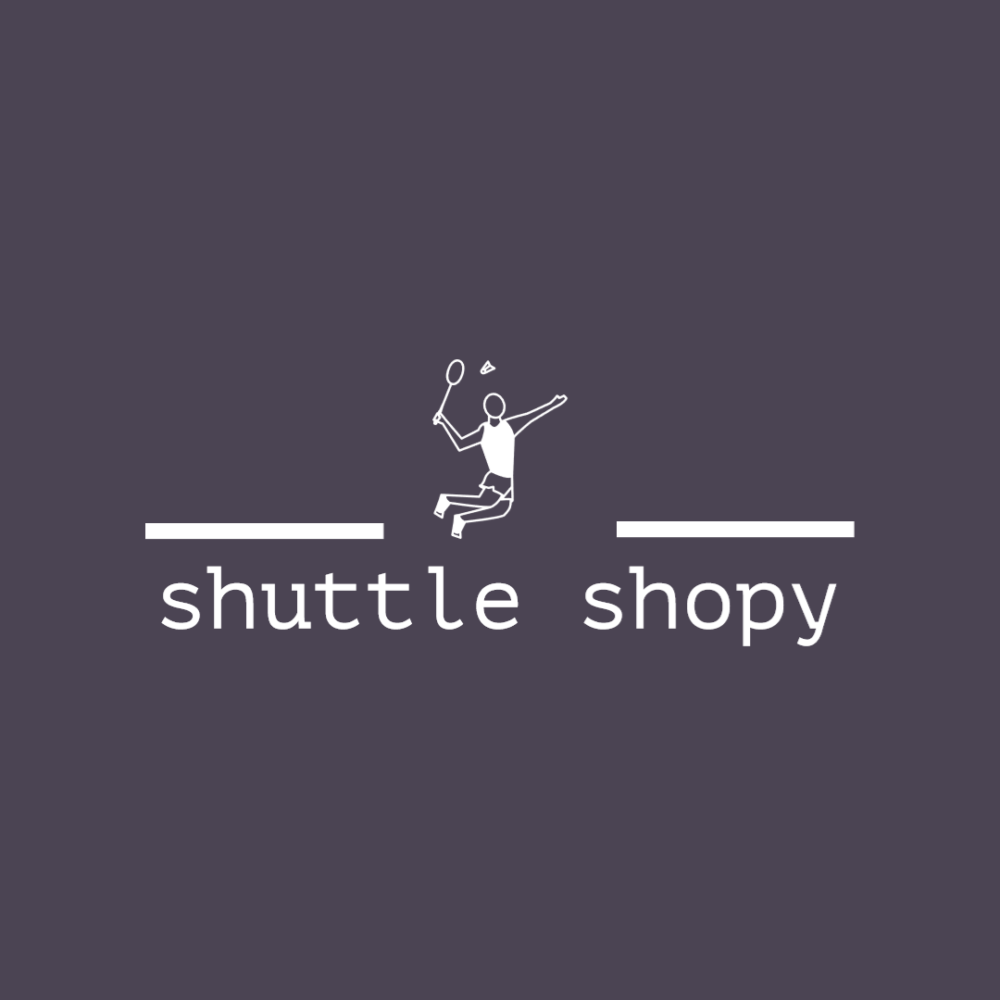

## Tech Stack 

## Shuttle Shopy
Shuttle shopy is an ecommerce where you can buy all badminton related accessories - Your ultimate stop to buy all badminton equipments. The website is in progress and right now only contains screens built in HTML and CSS.

## Pages included in Shuttle shopy

| Pages     | Link to Pages                                                            |
| ----------------- | ------------------------------------------------------------------ |
| Landing Page | [Click here to reach to landing page](https://shuttle-shopy.netlify.app/) |
| Product Listing Page | [Click here to reach to products page](https://shuttle-shopy.netlify.app/pages/product-listing-page.html) |
| Add to Cart Page | [Click here to reach to cart's page](https://shuttle-shopy.netlify.app/pages/shopping-cart.html) |
| Wishlist Page | [Click here to reach to wishlist page](https://shuttle-shopy.netlify.app/pages/wishlist.html) |
| Authentication Page | [Click here to reach to authentication page](https://shuttle-shopy.netlify.app/pages/login.html) |

## Demo

## Connect with me on - 

- [Github - Ankit Kumain](https://github.com/Maianki)
- [Twitter - Ankit Kumain](https://twitter.com/Ankit_k10)

## Feedback

If you have any feedback, please reach out to at [Twitter](https://twitter.com/Ankit_k10)

